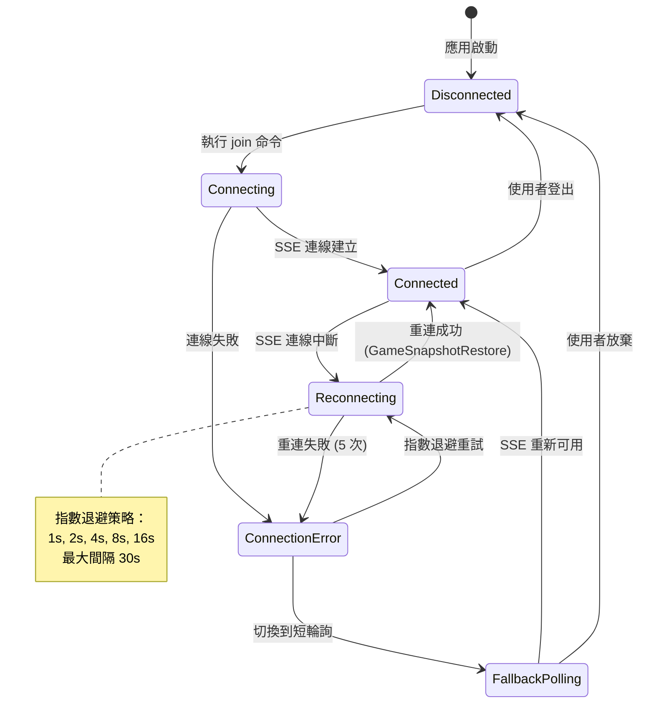
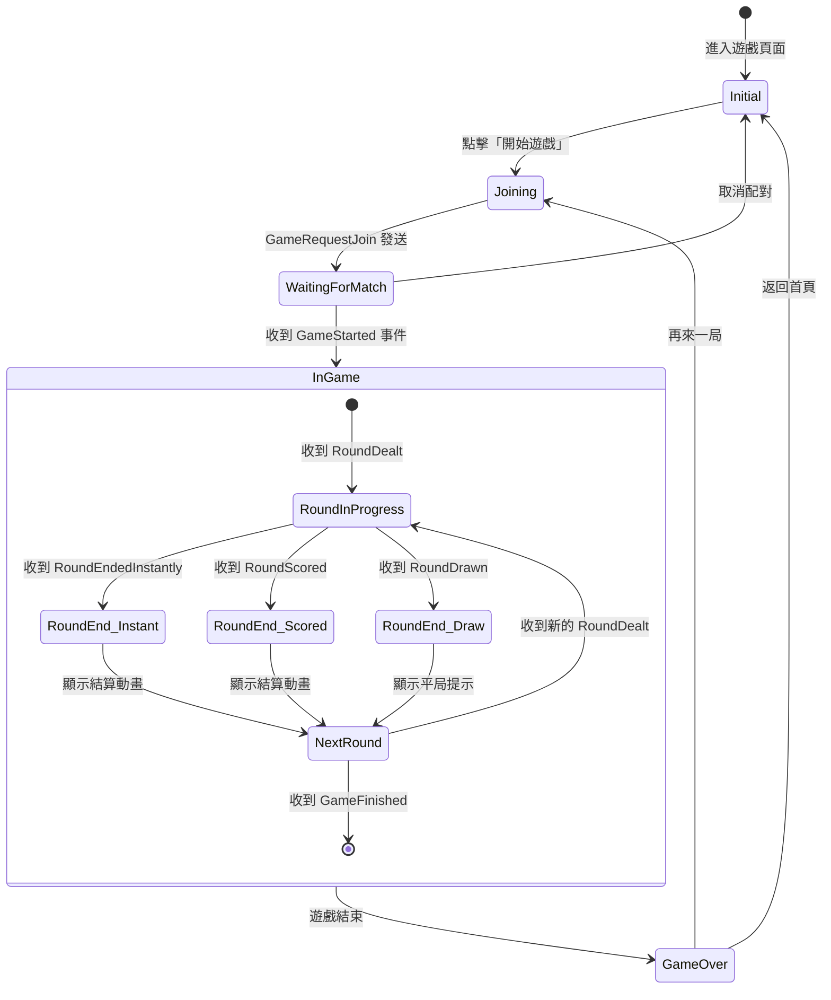
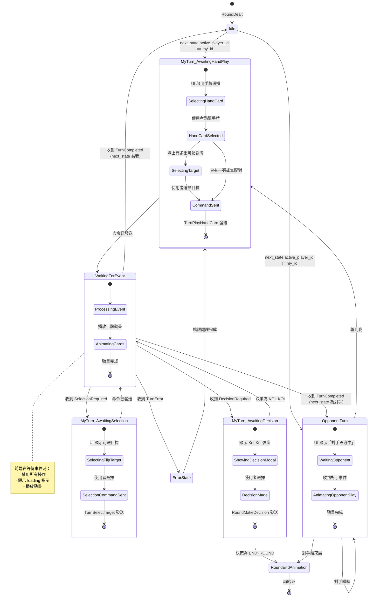
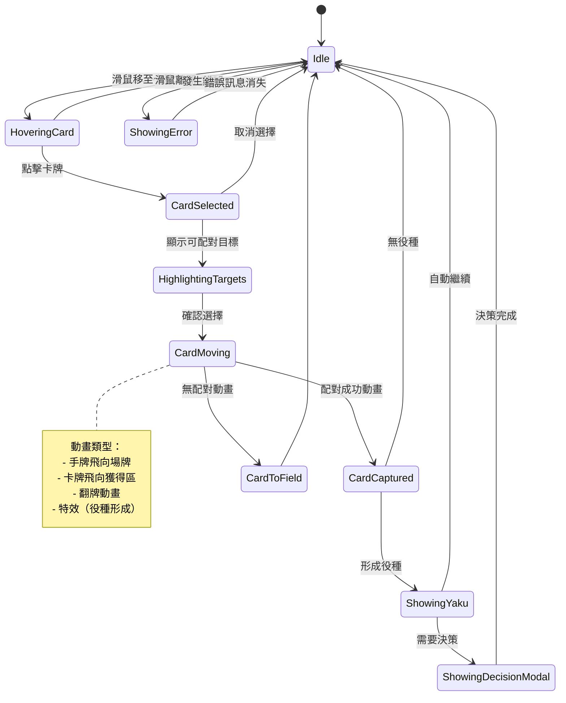
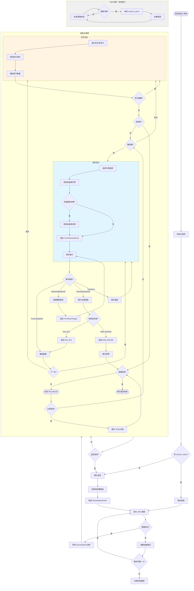

# 前端視角流程狀態圖

> 本文檔定義前端應用的狀態管理、SSE 事件處理、使用者互動流程

## 一、應用狀態層級架構

前端狀態分為四個層級：

```
┌─────────────────────────────────────┐
│  1. 連線狀態 (Connection Layer)      │  ← 最底層，控制 SSE 連線
├─────────────────────────────────────┤
│  2. 遊戲階段 (Game Phase Layer)      │  ← 遊戲生命週期
├─────────────────────────────────────┤
│  3. 回合狀態 (Turn State Layer)      │  ← 對應 FlowState
├─────────────────────────────────────┤
│  4. UI 互動 (UI Interaction Layer)   │  ← 使用者操作與動畫
└─────────────────────────────────────┘
```

---

## 二、連線狀態圖 (Connection State)



---

## 三、遊戲階段狀態圖 (Game Phase)



---

## 四、回合狀態圖 (Turn State)

這是前端最核心的狀態機，對應後端的 FlowState。



---

## 五、UI 互動狀態圖 (UI Interaction)



---

## 六、完整前端狀態流程圖

結合所有層級的綜合視圖：



---

## 七、關鍵前端狀態欄位

### 狀態管理結構（建議使用 Pinia/Vuex）

```typescript
interface FrontendGameState {
  // 1. 連線狀態
  connection: {
    status: 'disconnected' | 'connecting' | 'connected' | 'reconnecting' | 'error' | 'fallback',
    retryCount: number,
    lastEventId: string | null,
    sessionToken: string | null
  },

  // 2. 遊戲階段
  gamePhase: 'initial' | 'joining' | 'waiting' | 'inGame' | 'gameOver',

  // 3. 遊戲數據
  game: {
    id: string | null,
    myPlayerId: string | null,
    players: Array<{ player_id: string, name: string }>,
    ruleset: Ruleset | null,
    cumulativeScores: PlayerScore[],
    roundsPlayed: number
  },

  // 4. 回合狀態（對應 FlowState）
  turnState: {
    currentState: 'idle' | 'myTurn_awaitingHandPlay' | 'myTurn_awaitingSelection' |
                  'myTurn_awaitingDecision' | 'opponentTurn' | 'waitingForEvent',
    activePlayerId: string | null,

    // 子狀態上下文
    selectionContext: CardSelection | null,  // AWAITING_SELECTION 時使用
    yakuContext: YakuUpdate | null,          // AWAITING_DECISION 時使用
  },

  // 5. 卡牌數據
  cards: {
    field: string[],
    myHand: string[],
    opponentHandCount: number,
    myDepository: string[],
    opponentDepository: string[],
    deckRemaining: number
  },

  // 6. UI 互動狀態
  ui: {
    selectedHandCard: string | null,
    highlightedTargets: string[],
    isAnimating: boolean,
    showDecisionModal: boolean,
    errorMessage: string | null,

    // 動畫佇列
    animationQueue: Array<{
      type: 'cardMove' | 'cardCapture' | 'yakuEffect' | 'roundEnd',
      data: any
    }>
  }
}
```

---

## 八、SSE 事件處理映射表

| SSE 事件 | 前端狀態變更 | UI 動作 |
|---------|------------|---------|
| **GameStarted** | `gamePhase = 'inGame'` | 顯示遊戲畫面 |
| **RoundDealt** | 更新 `cards`、`turnState` | 發牌動畫 |
| **TurnCompleted** | `turnState = 下一玩家狀態` | 播放卡牌移動動畫 |
| **SelectionRequired** | `turnState = 'myTurn_awaitingSelection'` | 高亮可選目標 |
| **TurnProgressAfterSelection** | `turnState = 根據 next_state` | 播放選擇後動畫 |
| **DecisionRequired** | `turnState = 'myTurn_awaitingDecision'` | 顯示 Koi-Koi 彈窗 |
| **DecisionMade** | `turnState = 'myTurn_awaitingHandPlay'` | 更新倍數顯示 |
| **RoundScored** | 更新 `cumulativeScores` | 顯示結算畫面 |
| **RoundEndedInstantly** | 更新 `cumulativeScores` | 顯示特殊結束提示 |
| **RoundDrawn** | 無分數變化 | 顯示平局提示 |
| **GameFinished** | `gamePhase = 'gameOver'` | 顯示最終結果 |
| **TurnError** | `ui.errorMessage = message` | 顯示錯誤提示 |
| **GameSnapshotRestore** | 恢復所有狀態 | 重建 UI |

---

## 九、前端操作流程範例

### 範例 1：正常出牌流程

```
使用者操作                前端狀態變更                    SSE 事件接收
─────────────────────────────────────────────────────────────────
1. 點擊手牌「0341」      selectedHandCard = "0341"       -
2. 點擊配對目標「0342」  highlightedTargets = []         -
3. 發送命令              turnState = 'waitingForEvent'   -
4. -                     isAnimating = true              TurnCompleted
5. -                     播放動畫                        -
6. -                     turnState = 'opponentTurn'      -
7. -                     顯示「對手思考中」              -
8. -                     isAnimating = true              TurnCompleted (對手)
9. -                     turnState = 'myTurn_...'        -
```

### 範例 2：翻牌雙重配對流程

```
使用者操作                前端狀態變更                    SSE 事件接收
─────────────────────────────────────────────────────────────────
1. 出牌「0341」          turnState = 'waitingForEvent'   -
2. -                     播放手牌動畫                    SelectionRequired
3. -                     turnState = 'myTurn_awaitingSelection'  -
4. -                     selectionContext = {source, options}   -
5. -                     高亮可選目標                    -
6. 點擊目標「0842」      發送 TurnSelectTarget          -
7. -                     turnState = 'waitingForEvent'   TurnProgressAfterSelection
8. -                     播放翻牌動畫                    -
9. -                     turnState = 'opponentTurn'      -
```

### 範例 3：形成役種決策流程

```
使用者操作                前端狀態變更                    SSE 事件接收
─────────────────────────────────────────────────────────────────
1. 出牌                  turnState = 'waitingForEvent'   -
2. -                     播放動畫                        DecisionRequired
3. -                     turnState = 'myTurn_awaitingDecision'  -
4. -                     showDecisionModal = true        -
5. -                     yakuContext = {new, total_base} -
6. 點擊「繼續」          發送 RoundMakeDecision {KOI_KOI} -
7. -                     showDecisionModal = false       DecisionMade
8. -                     更新 Koi-Koi 倍數顯示          -
9. -                     turnState = 'opponentTurn'      -
```

### 範例 4：斷線重連流程

```
事件                     前端狀態變更                    SSE 事件接收
─────────────────────────────────────────────────────────────────
1. SSE 連線中斷          connection.status = 'reconnecting'  -
2. -                     保存 sessionToken 到 localStorage  -
3. -                     顯示「連線中斷，正在重連...」   -
4. -                     第 1 次重試（1s 後）            -
5. -                     發送 GameRequestJoin + sessionToken  -
6. -                     connection.status = 'connected'  GameSnapshotRestore
7. -                     恢復所有狀態（game, cards, flow_state）  -
8. -                     根據 flow_state.state_type 渲染 UI  -
9. -                     顯示「連線已恢復」              -
```

---

## 十、錯誤處理策略

### 錯誤類型與前端處理

| 錯誤類型 | 觸發條件 | 前端處理 |
|---------|---------|---------|
| **INVALID_CARD** | 打出不在手牌中的牌 | 顯示「此牌不在手牌中」，重置選擇 |
| **INVALID_TARGET** | 選擇無效的配對目標 | 顯示「無效的配對目標」，重新選擇 |
| **WRONG_PLAYER** | 不在自己回合時操作 | 顯示「請等待您的回合」，禁用操作 |
| **INVALID_STATE** | 在錯誤的 FlowState 發送命令 | 顯示「操作無效」，刷新狀態 |
| **INVALID_SELECTION** | 在非 AWAITING_SELECTION 時選擇 | 顯示「當前無需選擇」，重置 |
| **連線錯誤** | SSE 連線失敗 | 自動重連（指數退避） |
| **超時錯誤** | 命令發送後長時間無回應 | 顯示「伺服器無回應」，重試或重連 |

---

## 十一、前端效能優化建議

### 1. 狀態更新策略
- 使用 **Immutable 更新**（Vue 3 響應式系統）
- SSE 事件處理使用 **防抖/節流**（避免連續事件導致 UI 閃爍）
- 卡牌動畫使用 **requestAnimationFrame**

### 2. 動畫佇列管理
```typescript
// 動畫佇列：確保動畫按順序播放
const animationQueue = ref<Animation[]>([])

async function processAnimationQueue() {
  while (animationQueue.value.length > 0) {
    const animation = animationQueue.value[0]
    await playAnimation(animation)
    animationQueue.value.shift()
  }
}
```

### 3. SSE 重連策略
```typescript
// 指數退避重連
const retryDelays = [1000, 2000, 4000, 8000, 16000] // ms
let retryCount = 0

function reconnectSSE() {
  const delay = retryDelays[Math.min(retryCount, retryDelays.length - 1)]
  setTimeout(() => {
    establishSSEConnection()
    retryCount++
  }, delay)
}
```

### 4. 狀態持久化
```typescript
// 使用 localStorage 保存關鍵狀態
function saveSessionState() {
  localStorage.setItem('hanafuda_session', JSON.stringify({
    sessionToken: state.connection.sessionToken,
    gameId: state.game.id,
    myPlayerId: state.game.myPlayerId
  }))
}

// 應用啟動時恢復
function restoreSessionState() {
  const saved = localStorage.getItem('hanafuda_session')
  if (saved) {
    const { sessionToken, gameId, myPlayerId } = JSON.parse(saved)
    // 嘗試重連
  }
}
```

---

## 十二、前端測試建議

### 1. 單元測試（Vitest）
- 測試狀態管理邏輯（Pinia store）
- 測試 SSE 事件處理函數
- 測試動畫佇列邏輯

### 2. 組件測試（Vue Test Utils）
- 測試 UI 組件的狀態響應
- 測試使用者互動（點擊、選擇）
- 測試錯誤顯示

### 3. E2E 測試（Playwright）
- 測試完整遊戲流程
- 測試斷線重連
- 測試錯誤恢復

### 4. Mock SSE 測試
```typescript
// 模擬 SSE 事件推送
function mockSSEEvent(eventType: string, data: any) {
  const event = new MessageEvent(eventType, {
    data: JSON.stringify(data)
  })
  eventSource.dispatchEvent(event)
}

// 測試案例
test('收到 TurnCompleted 後更新狀態', () => {
  mockSSEEvent('TurnCompleted', {
    player_id: 'p1',
    hand_play: { card: '0341', captured: ['0342'] },
    deck_flip: { card: '0843', captured: [] },
    deck_remaining: 23,
    next_state: { state_type: 'AWAITING_HAND_PLAY', active_player_id: 'p2' }
  })

  expect(store.turnState.currentState).toBe('opponentTurn')
})
```

---

## 總結

這份文檔定義了前端應用的完整狀態流程，包括：

1. ✅ **四層狀態架構**：連線、遊戲階段、回合狀態、UI 互動
2. ✅ **詳細狀態圖**：從前端視角繪製所有狀態轉換
3. ✅ **SSE 事件映射**：每個事件對應的前端處理
4. ✅ **操作流程範例**：4 種典型場景的完整流程
5. ✅ **錯誤處理策略**：所有錯誤類型的前端處理
6. ✅ **效能優化建議**：動畫佇列、重連策略、狀態持久化
7. ✅ **測試建議**：單元測試、組件測試、E2E 測試

**與後端文檔對齊**：
- ✅ 完全遵循 `game-flow.md` 的 FlowState 定義
- ✅ 對應 `readme.md` 的通訊架構設計
- ✅ 補充 `redraw.md` 中缺少的前端細節

**下一步**：
1. 使用此狀態圖實作前端狀態管理（Pinia）
2. 實作 SSE 事件監聽與處理邏輯
3. 實作動畫佇列與 UI 互動邏輯
4. 實作斷線重連機制
