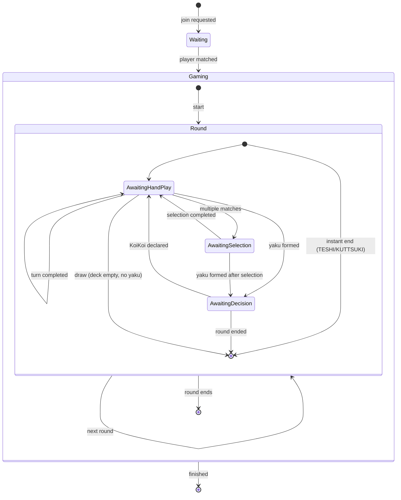
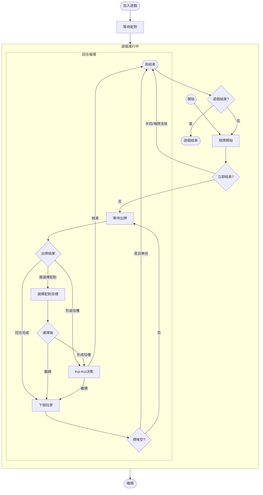

# REDRAW

## 狀態機圖

```mermaid
stateDiagram-v2
    [*] --> Waiting : join requested
    Waiting --> Gaming : player matched
    Gaming --> [*] : finished

    state Gaming {
        [*] --> Round : start
        Round --> Round : next round
        Round --> [*] : round ends
    }

    state Round {
        [*] --> AwaitingHandPlay
        [*] --> [*] : instant end (TESHI/KUTTSUKI)

        AwaitingHandPlay --> AwaitingHandPlay : turn completed
        AwaitingHandPlay --> AwaitingSelection : multiple matches
        AwaitingHandPlay --> AwaitingDecision : yaku formed

        AwaitingSelection --> AwaitingHandPlay : selection completed
        AwaitingSelection --> AwaitingDecision : yaku formed after selection

        AwaitingDecision --> AwaitingHandPlay : KoiKoi declared
        AwaitingDecision --> [*] : round ended

        AwaitingHandPlay --> [*] : draw (deck empty, no yaku)
    }
```

## 流程圖

```mermaid
flowchart TD
    Start([加入遊戲]) --> Waiting[等待配對]
    Waiting --> Gaming

    subgraph Gaming["遊戲進行中"]
        direction TB
        GamingStart((開始)) --> RoundStart[發牌開始]
        RoundStart --> CheckInstant{立即結束?}
        CheckInstant -->|手四/場牌流局| RoundEnd([局結束])
        CheckInstant -->|否| Play

        subgraph Round["回合循環"]
            Play[等待出牌] --> PlayCard{出牌結果}
            PlayCard -->|需選擇配對| Select[選擇配對目標]
            PlayCard -->|形成役種| Decision[Koi-Koi決策]
            PlayCard -->|回合完成| NextTurn[下個玩家]

            Select --> SelectResult{選擇後}
            SelectResult -->|形成役種| Decision
            SelectResult -->|繼續| NextTurn

            Decision -->|繼續| NextTurn
            Decision -->|結束| RoundEnd

            NextTurn --> CheckDraw{牌堆空?}
            CheckDraw -->|是且無役| RoundEnd
            CheckDraw -->|否| Play
        end

        RoundEnd --> CheckGame{遊戲結束?}
        CheckGame -->|否| RoundStart
        CheckGame -->|是| GameEnd([遊戲結束])
    end

    Gaming --> Finish([離開])
```