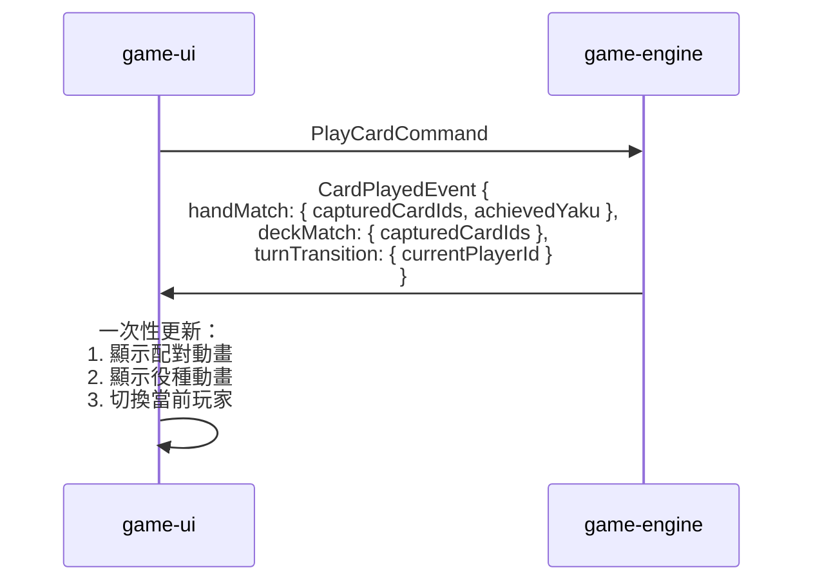
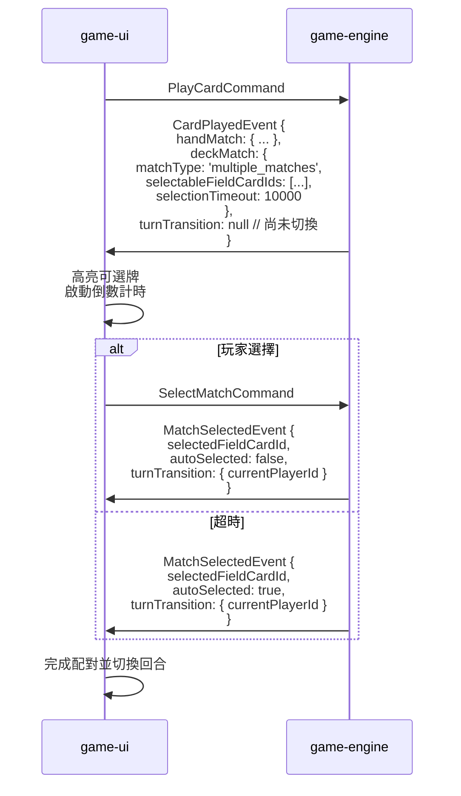

# 事件結構優化提案

## 目標

避免連續發送多個事件，通過嵌套數據結構精簡事件流程。

## 核心改進

### 1. 創建 `MatchResult` 數據結構（配對結果）

```typescript
interface MatchResult {
  // 配對來源
  sourceCardId: string
  sourceType: 'hand' | 'deck'

  // 配對結果（三種情況）
  matchType: 'no_match' | 'single_match' | 'multiple_matches'

  // 單一配對時
  matchedFieldCardId?: string
  capturedCardIds?: string[]

  // 多重配對時（需要玩家選擇）
  selectableFieldCardIds?: string[]
  selectedFieldCardId?: string  // 玩家選擇後才有值
  autoSelected?: boolean        // 是否自動選擇（超時）

  // 配對成功後可能達成的役種
  achievedYaku?: YakuResult[]
}

interface YakuResult {
  yaku: string
  points: number
  cardIds: string[]
}
```

### 2. 創建 `TurnTransition` 數據結構（回合切換）

```typescript
interface TurnTransition {
  previousPlayerId: string
  currentPlayerId: string
  reason: 'card_played' | 'koikoi_declared' | 'game_initialized'
}
```

### 3. 合併事件

#### 原本：CardPlayedEvent + YakuAchievedEvent + PlayerTurnChangedEvent

```json
// ❌ 舊方案：需要連續發送 3 個事件
{
  "eventType": "CardPlayed",
  "playedCardId": "1-bright-0",
  "handCapturedCardIds": ["1-bright-0", "1-plain-0"]
}
{
  "eventType": "YakuAchieved",
  "yakuResults": [{"yaku": "SANKO", "points": 5}]
}
{
  "eventType": "PlayerTurnChanged",
  "currentPlayerId": "player-2"
}
```

#### 優化後：單一 CardPlayedEvent 包含完整信息

```json
// ✅ 新方案：一個事件包含所有信息
{
  "eventType": "CardPlayed",
  "playerId": "player-1",
  "playedCardId": "1-bright-0",

  // 嵌套：手牌配對結果
  "handMatch": {
    "sourceCardId": "1-bright-0",
    "sourceType": "hand",
    "matchType": "single_match",
    "matchedFieldCardId": "1-plain-0",
    "capturedCardIds": ["1-bright-0", "1-plain-0"],
    "achievedYaku": null
  },

  // 嵌套：牌堆配對結果
  "deckMatch": {
    "sourceCardId": "3-ribbon-0",
    "sourceType": "deck",
    "matchType": "single_match",
    "matchedFieldCardId": "3-plain-0",
    "capturedCardIds": ["3-ribbon-0", "3-plain-0"],
    "achievedYaku": [
      {
        "yaku": "SANKO",
        "points": 5,
        "cardIds": ["1-bright-0", "3-bright-0", "8-bright-0"]
      }
    ]
  },

  // 嵌套：回合切換（如果有）
  "turnTransition": {
    "previousPlayerId": "player-1",
    "currentPlayerId": "player-2",
    "reason": "card_played"
  }
}
```

### 4. 處理多重配對選擇

#### 原本：DeckCardRevealedEvent + MatchSelectionRequiredEvent + MatchSelectionTimeoutEvent

```json
// ❌ 舊方案：需要 2-3 個事件
{
  "eventType": "DeckCardRevealed",
  "deckCardId": "3-ribbon-0",
  "matchableFieldCardIds": ["3-plain-0", "3-plain-1"]
}
{
  "eventType": "MatchSelectionRequired",
  "sourceCardId": "3-ribbon-0",
  "selectableFieldCardIds": ["3-plain-0", "3-plain-1"],
  "timeoutMs": 10000
}
// ... 如果超時 ...
{
  "eventType": "MatchSelectionTimeout",
  "autoSelectedFieldCardId": "3-plain-0"
}
```

#### 優化後：CardPlayedEvent 直接包含選擇狀態

```json
// ✅ 新方案：一個事件，明確狀態
{
  "eventType": "CardPlayed",
  "playerId": "player-1",
  "playedCardId": "2-animal-0",

  "handMatch": {
    "sourceCardId": "2-animal-0",
    "sourceType": "hand",
    "matchType": "single_match",
    "matchedFieldCardId": "2-plain-0",
    "capturedCardIds": ["2-animal-0", "2-plain-0"]
  },

  // 牌堆翻牌遇到多重配對
  "deckMatch": {
    "sourceCardId": "3-ribbon-0",
    "sourceType": "deck",
    "matchType": "multiple_matches",
    "selectableFieldCardIds": ["3-plain-0", "3-plain-1"],
    "selectedFieldCardId": null,  // 尚未選擇
    "selectionTimeout": 10000     // 選擇時限（毫秒）
  },

  // 此時沒有回合切換（等待玩家選擇）
  "turnTransition": null
}
```

玩家選擇後，發送 `MatchSelectedEvent`：

```json
{
  "eventType": "MatchSelected",
  "playerId": "player-1",
  "sourceCardId": "3-ribbon-0",
  "selectedFieldCardId": "3-plain-0",
  "autoSelected": false,  // 玩家主動選擇
  "capturedCardIds": ["3-ribbon-0", "3-plain-0"],
  "achievedYaku": null,

  // 選擇完成後切換回合
  "turnTransition": {
    "previousPlayerId": "player-1",
    "currentPlayerId": "player-2",
    "reason": "card_played"
  }
}
```

如果超時自動選擇：

```json
{
  "eventType": "MatchSelected",
  "playerId": "player-1",
  "sourceCardId": "3-ribbon-0",
  "selectedFieldCardId": "3-plain-0",
  "autoSelected": true,   // 自動選擇
  "capturedCardIds": ["3-ribbon-0", "3-plain-0"],
  "turnTransition": {
    "previousPlayerId": "player-1",
    "currentPlayerId": "player-2",
    "reason": "card_played"
  }
}
```

### 5. GameInitializedEvent 包含初始回合

```json
{
  "eventType": "GameInitialized",
  "gameState": {
    "gameId": "game-123",
    "currentRound": 1,
    "phase": "playing",
    "currentPlayerId": "player-1",
    // ...
  },
  "cardDefinitions": [...],

  // 初始回合資訊
  "turnTransition": {
    "previousPlayerId": null,
    "currentPlayerId": "player-1",
    "reason": "game_initialized"
  }
}
```

### 6. KoikoiDeclaredEvent 包含回合切換

```json
{
  "eventType": "KoikoiDeclared",
  "playerId": "player-1",
  "declared": true,  // true = 繼續, false = 結束

  // 如果選擇繼續（koikoi），則切換回合
  "turnTransition": {
    "previousPlayerId": "player-1",
    "currentPlayerId": "player-2",
    "reason": "koikoi_declared"
  }

  // 如果選擇結束（shobu），turnTransition 為 null
  // 接著會發送 RoundEndedEvent
}
```

## 優化後的事件列表

| 事件類型 | 用途 | 嵌套結構 |
|---------|------|---------|
| `GameInitializedEvent` | 遊戲初始化 | + `TurnTransition` |
| `CardPlayedEvent` | 玩家出牌（完整流程） | + `MatchResult` (hand)<br>+ `MatchResult` (deck)<br>+ `TurnTransition` |
| `MatchSelectedEvent` | 玩家完成多重配對選擇 | + `YakuResult[]`<br>+ `TurnTransition` |
| `KoikoiDeclaredEvent` | Koi-Koi 宣告 | + `TurnTransition` (可選) |
| `RoundEndedEvent` | 回合結束 | 不變 |
| `GameEndedEvent` | 遊戲結束 | 不變 |
| `GameAbandonedEvent` | 玩家放棄 | 不變 |

## 刪除的事件

- ❌ `DeckCardRevealedEvent` → 合併到 `CardPlayedEvent.deckMatch`
- ❌ `MatchSelectionRequiredEvent` → 合併到 `CardPlayedEvent.deckMatch` (`matchType: 'multiple_matches'`)
- ❌ `MatchSelectionTimeoutEvent` → 合併到 `MatchSelectedEvent.autoSelected`
- ❌ `PlayerTurnChangedEvent` → 嵌套到各事件的 `turnTransition`
- ❌ `YakuAchievedEvent` → 嵌套到 `MatchResult.achievedYaku`

## 優化後的時序流程

### 場景 1：玩家出牌（有配對 + 達成役種）



**對比舊方案（3 個事件）**：
```
CardPlayedEvent → YakuAchievedEvent → PlayerTurnChangedEvent
```

### 場景 2：牌堆翻牌多重配對



**對比舊方案（3-4 個事件）**：
```
DeckCardRevealedEvent → MatchSelectionRequiredEvent
→ [MatchSelectionTimeoutEvent] → CardPlayedEvent
```

## 優勢總結

### 1. 減少事件數量
- **舊方案**：一次出牌可能需要 3-4 個事件
- **新方案**：一次出牌通常只需 1 個事件（多重配對時需要 2 個）

### 2. 原子性更好
- 所有相關信息在同一個事件中，避免 UI 接收到部分狀態

### 3. 更符合業務語義
- "打出牌" 是一個完整的動作，應該包含配對結果、役種、回合切換
- 不需要拆分成多個技術性事件

### 4. 簡化 UI 處理邏輯
```typescript
// ❌ 舊方案：需要跨事件維護狀態
onCardPlayed(event) {
  this.pendingMatch = event  // 等待後續事件
}
onYakuAchieved(event) {
  // 需要關聯 pendingMatch
}
onPlayerTurnChanged(event) {
  // 需要知道是哪個動作觸發的切換
}

// ✅ 新方案：一次性處理完整
onCardPlayed(event) {
  this.updateMatches(event.handMatch, event.deckMatch)
  if (event.deckMatch.achievedYaku) {
    this.showYakuAnimation(event.deckMatch.achievedYaku)
  }
  if (event.turnTransition) {
    this.switchPlayer(event.turnTransition.currentPlayerId)
  }
}
```

### 5. 更容易實現動畫編排
UI 可以一次性獲得所有動畫需要的數據，按順序播放：
1. 手牌配對動畫
2. 牌堆翻牌動畫
3. 役種達成動畫
4. 回合切換動畫

### 6. 減少網路傳輸
- 減少事件數量 = 減少網路往返次數（在未來實現 WebSocket 時更明顯）

## 實現注意事項

1. **JSON Schema 更新**：需要重新設計 `CardPlayedEvent` 的 schema
2. **向後兼容**：如果已有實現，需要版本遷移策略
3. **測試調整**：Contract Testing 需要更新測試案例
4. **文檔同步**：更新時序圖和 README

## 下一步行動

- [ ] 更新 `integration-events-schema.json`
- [ ] 更新 `event-sequence-diagram.md` 中的時序圖
- [ ] 更新 Contract Testing 測試案例
- [ ] 更新 `data-model.md` 中的相關說明
