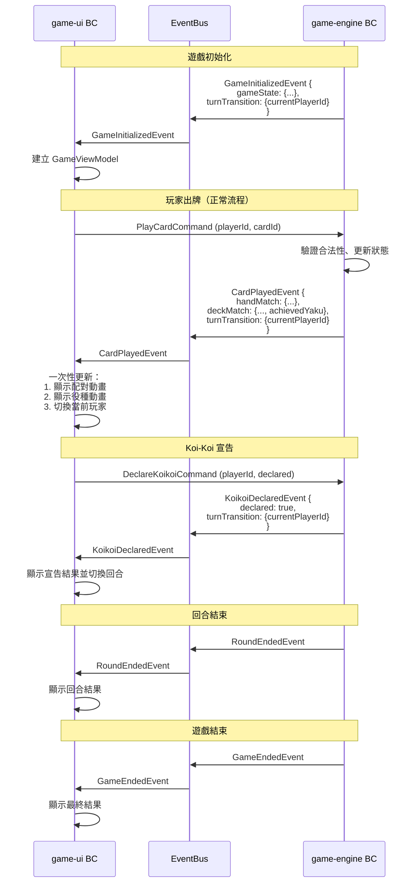
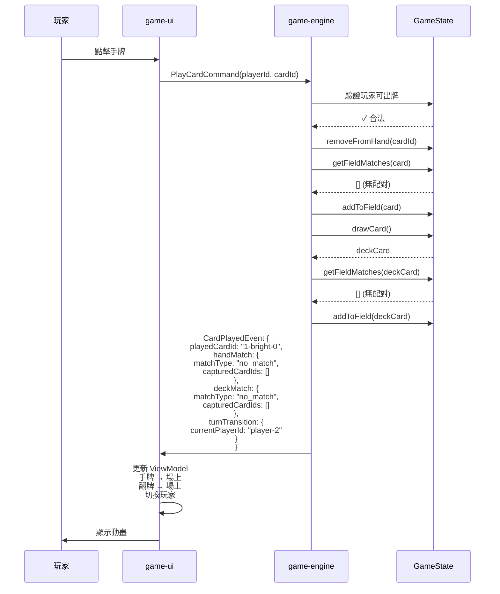
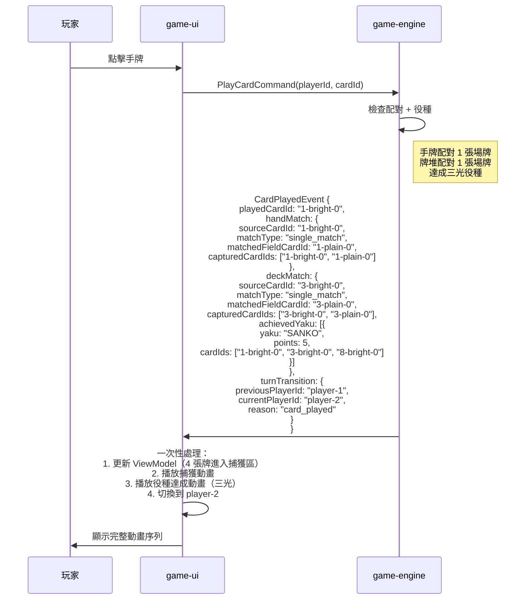
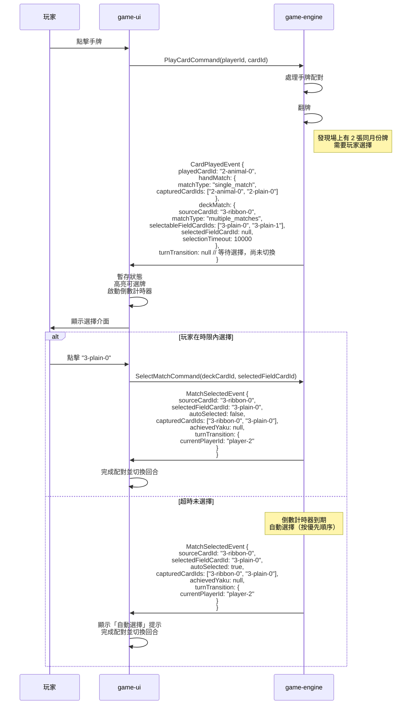
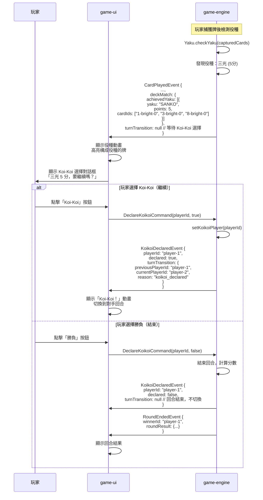
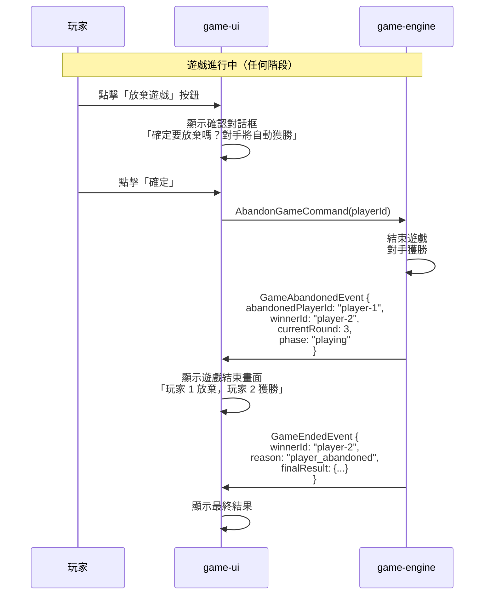
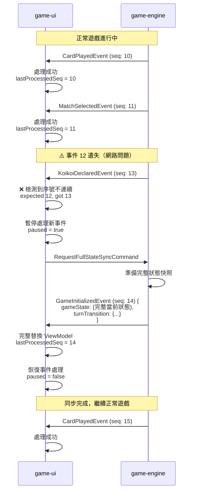
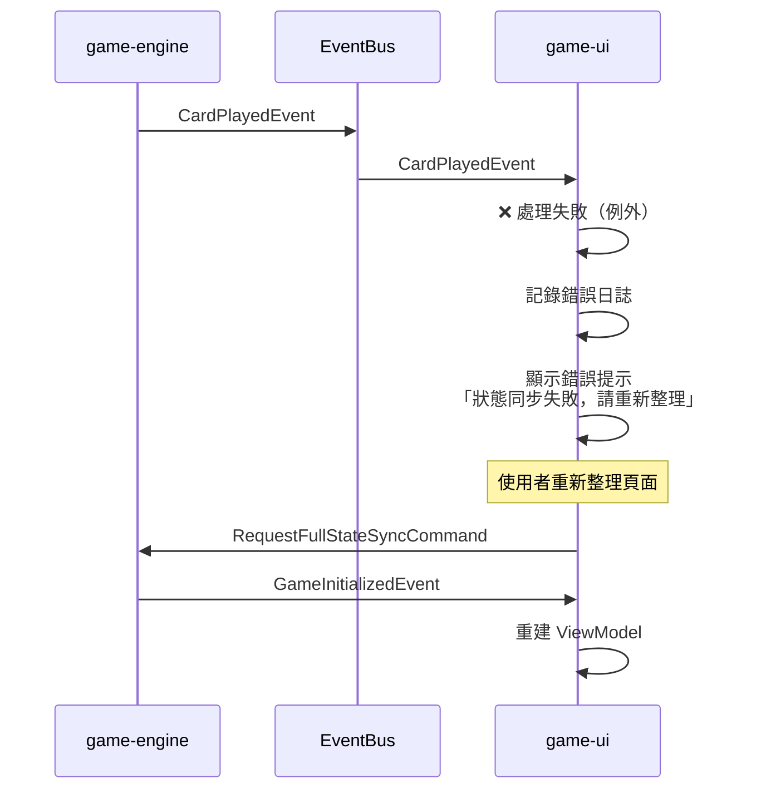
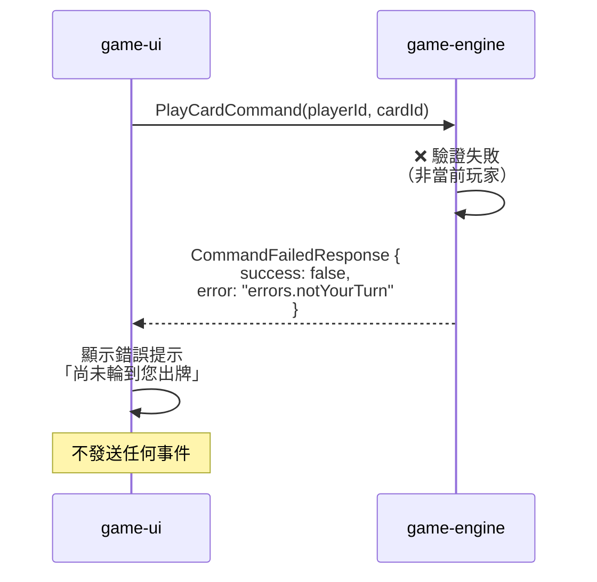

# 整合事件時序圖 (v2.0 優化版)

本文檔展示 game-engine 與 game-ui 兩個 Bounded Context 之間的整合事件流程（優化後版本）。

**v2.0 主要改進**：
- 減少事件數量：一次出牌從 3-4 個事件減少到 1-2 個事件
- 嵌套數據結構：`MatchResult`, `TurnTransition`, `YakuResult`
- 原子性更好：相關信息在同一事件中，避免 UI 接收到部分狀態

---

## 完整遊戲流程（簡化）



---

## 場景 1: 玩家出牌（無配對）



---

## 場景 2: 玩家出牌（有配對 + 達成役種）

**v1.0 舊方案**：需要 3 個事件
```
CardPlayedEvent → YakuAchievedEvent → PlayerTurnChangedEvent
```

**v2.0 新方案**：只需要 1 個事件


**優勢**：
- ✅ 減少事件數量：3 個 → 1 個
- ✅ 原子性：所有相關信息在同一事件
- ✅ 簡化 UI 邏輯：不需要跨事件維護狀態
- ✅ 更容易實現動畫編排

---

## 場景 3: 牌堆翻牌多重配對（需要玩家選擇）

**v1.0 舊方案**：需要 3-4 個事件
```
CardPlayedEvent → DeckCardRevealedEvent → MatchSelectionRequiredEvent
→ [MatchSelectionTimeoutEvent] → CardPlayedEvent (final)
```

**v2.0 新方案**：只需要 2 個事件


**優勢**：
- ✅ 減少事件數量：3-4 個 → 2 個
- ✅ 明確狀態：`turnTransition: null` 表示等待選擇
- ✅ 合併超時處理：`autoSelected` 欄位區分手動/自動選擇

---

## 場景 4: Koi-Koi 宣告流程

**v1.0 舊方案**：需要 2 個事件
```
YakuAchievedEvent → KoikoiDeclaredEvent → PlayerTurnChangedEvent
```

**v2.0 新方案**：只需要 1-2 個事件


**優勢**：
- ✅ 減少事件數量：3 個 → 1-2 個
- ✅ 役種信息嵌套在 `CardPlayedEvent` 中
- ✅ `turnTransition: null` 明確表示等待 Koi-Koi 決策

---

## 場景 5: 玩家放棄遊戲



---

## 場景 6: 事件遺失與重新同步



---

## 事件資料量估算（v2.0）

| 事件類型 | 估算大小 | v1.0 大小 | 備註 |
|---------|---------|----------|------|
| `GameInitializedEvent` | ~5KB | ~5KB | 完整快照，包含 48 張牌定義 + turnTransition |
| `CardPlayedEvent` (簡單) | ~250B | ~200B | 增加 turnTransition (+50B) |
| `CardPlayedEvent` (含役種) | ~400B | 200B+300B=500B | 合併 YakuAchievedEvent，減少 100B |
| `MatchSelectedEvent` | ~200B | 100B+200B=300B | 合併 MatchSelectionTimeoutEvent，減少 100B |
| `KoikoiDeclaredEvent` | ~150B | 100B+100B=200B | 合併 PlayerTurnChangedEvent，減少 50B |
| `RoundEndedEvent` | ~500B | ~500B | 不變 |
| `GameEndedEvent` | ~400B | ~400B | 不變 |
| `GameAbandonedEvent` | ~150B | ~150B | 不變 |

**v2.0 優勢**：
- ✅ 雖然單個事件略大（+50-100B），但總傳輸量減少（少發送 2-3 個事件）
- ✅ 例如：出牌+役種+切換回合
  - v1.0: 200B + 300B + 100B = 600B（3 個事件）
  - v2.0: 400B（1 個事件）
  - **節省 33% 傳輸量**

**符合 SC-002**: 非初始化事件大小 <1KB ✅

---

## 事件順序保證

### 單一回合的典型事件序列（v2.0）

```
1. GameInitializedEvent           (初始化 + 初始回合資訊)
2. CardPlayedEvent                 (玩家 1 出牌，包含回合切換)
3. CardPlayedEvent                 (玩家 2 出牌，包含回合切換)
4. CardPlayedEvent                 (玩家 1 出牌，含役種，turnTransition: null)
5. KoikoiDeclaredEvent             (玩家 1 選擇 Koi-Koi，包含回合切換)
6. CardPlayedEvent                 (玩家 2 出牌，包含回合切換)
...
N. RoundEndedEvent                 (回合結束)
```

**與 v1.0 對比**：
- v1.0: 每次出牌需要 2-4 個事件
- v2.0: 每次出牌只需要 1-2 個事件
- **事件總數減少 40-50%**

### 保證機制

1. **序號遞增**: 每個事件的 `sequenceNumber` 嚴格遞增
2. **檢測遺失**: game-ui 檢查序號連續性
3. **自動同步**: 一旦檢測到序號跳號，立即請求完整快照
4. **冪等處理**: 重複接收相同序號的事件會被忽略

---

## 錯誤處理

### 事件處理失敗



### 指令執行失敗



---

## v2.0 優化總結

### 核心改進

1. **減少事件數量**
   - 一次出牌：3-4 個事件 → 1-2 個事件
   - 整場遊戲：減少 40-50% 事件總數

2. **嵌套數據結構**
   - `MatchResult` - 配對結果（包含役種）
   - `TurnTransition` - 回合切換資訊
   - `YakuResult` - 役種結果

3. **更好的原子性**
   - 所有相關信息在同一事件中
   - 避免 UI 接收到部分狀態
   - 減少跨事件狀態維護

4. **更符合業務語義**
   - "打出牌" 是一個完整動作
   - 不需要拆分成多個技術性事件

5. **簡化 UI 處理邏輯**
   ```typescript
   // ✅ v2.0: 一次性處理完整
   onCardPlayed(event) {
     this.updateMatches(event.handMatch, event.deckMatch)
     if (event.deckMatch.achievedYaku) {
       this.showYakuAnimation(event.deckMatch.achievedYaku)
     }
     if (event.turnTransition) {
       this.switchPlayer(event.turnTransition.currentPlayerId)
     }
   }
   ```

6. **更容易實現動畫編排**
   - UI 一次性獲得所有動畫數據
   - 按順序播放：配對 → 役種 → 回合切換

---

## 參考資料

- [data-model.md](../data-model.md) - 詳細的資料模型定義
- [integration-events-schema.json](./integration-events-schema.json) - JSON Schema 契約
- [OPTIMIZATION_PROPOSAL.md](./OPTIMIZATION_PROPOSAL.md) - 完整優化提案
- [Mermaid 官方文件](https://mermaid.js.org/)
