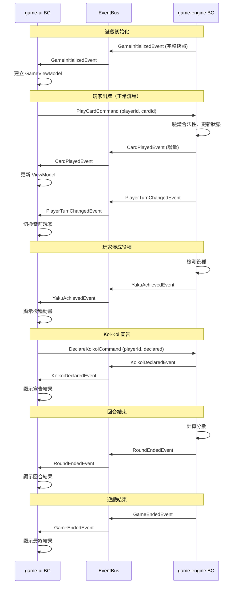
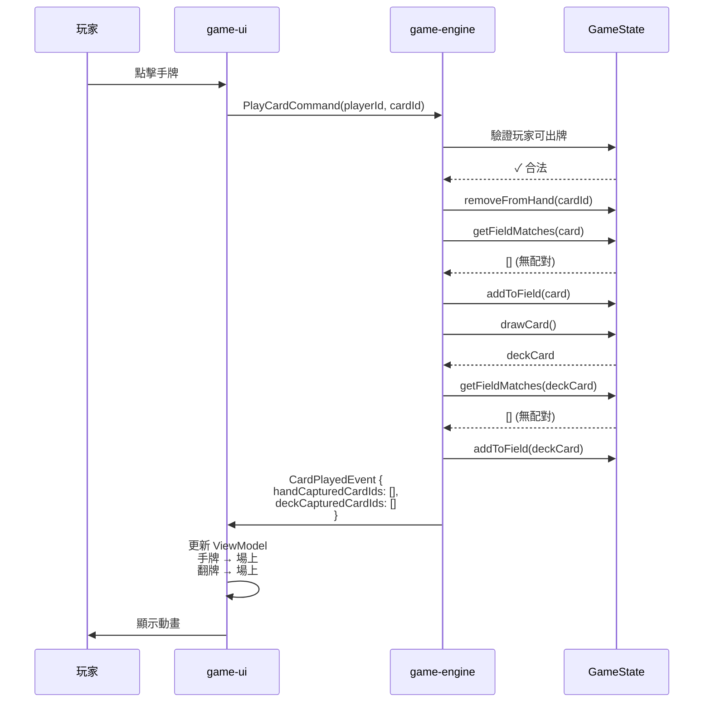
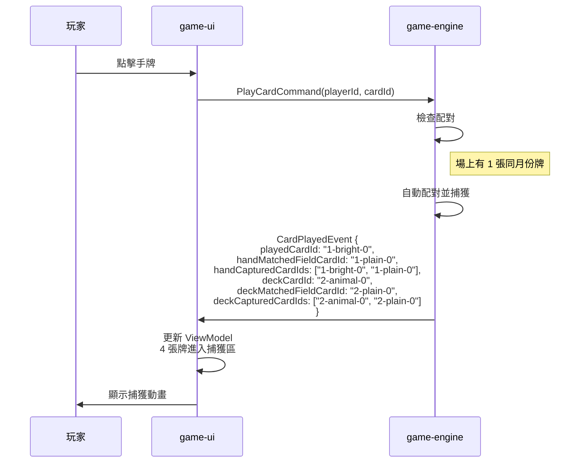
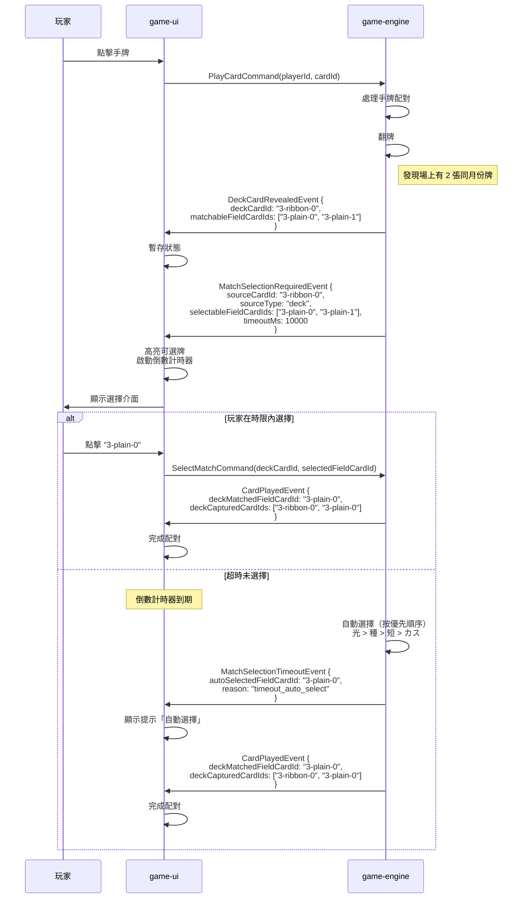
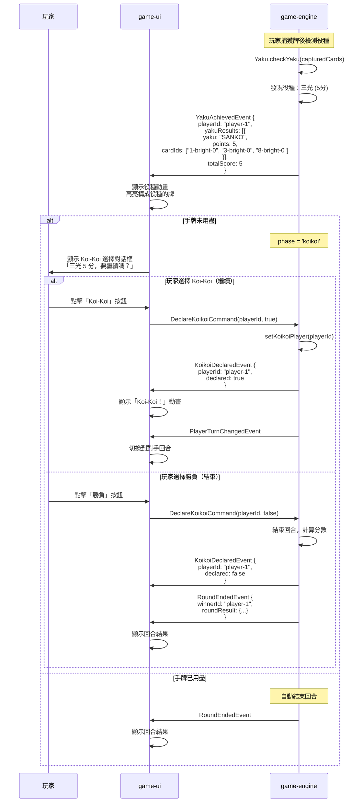
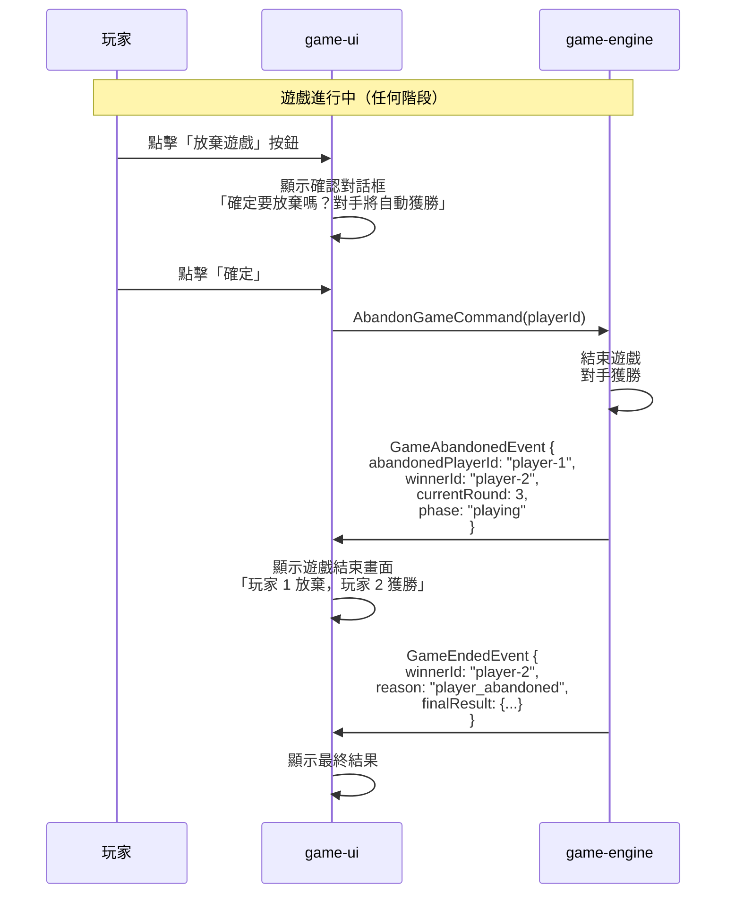
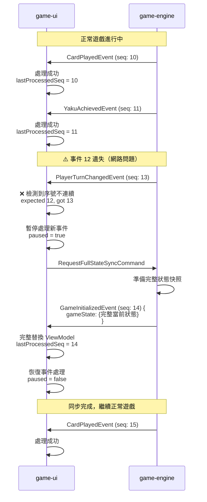
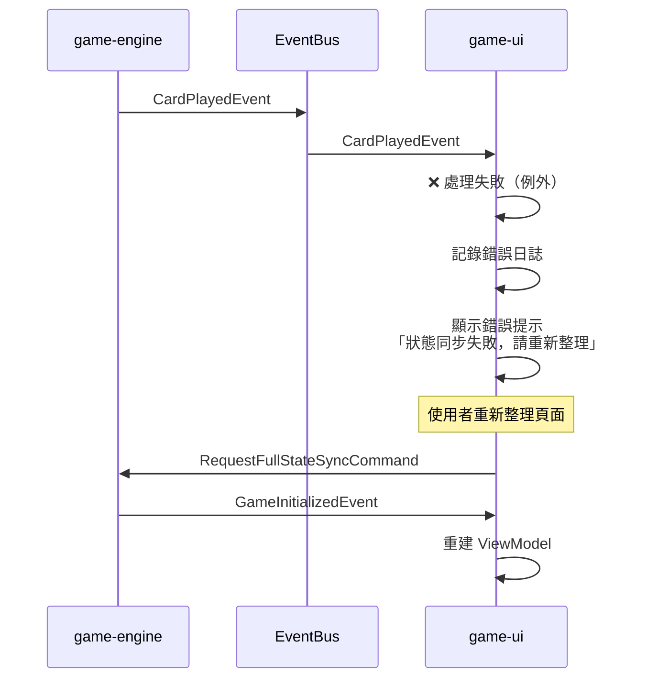
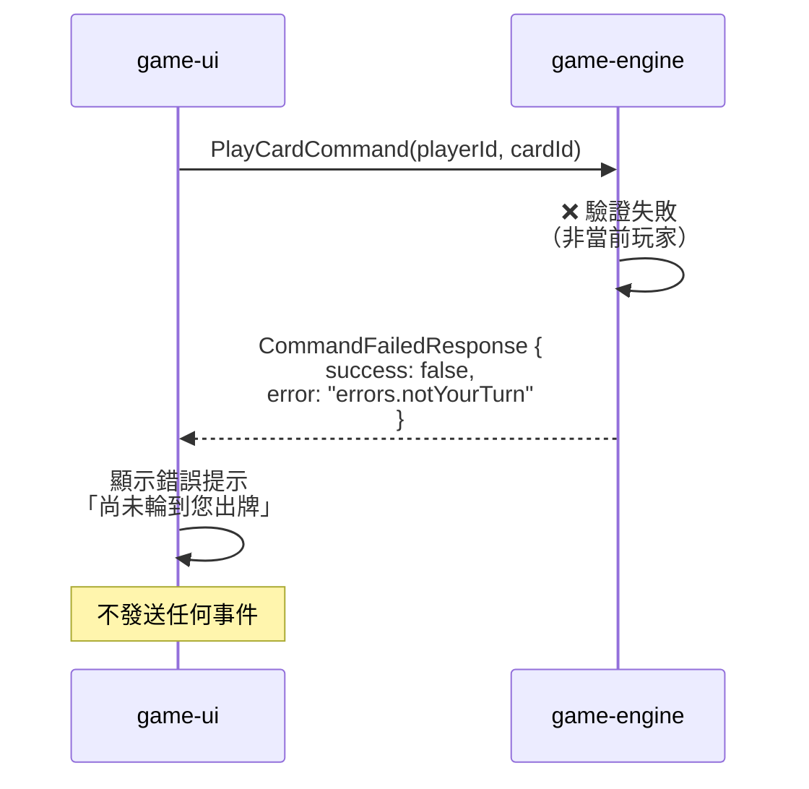

# 整合事件時序圖

本文檔展示 game-engine 與 game-ui 兩個 Bounded Context 之間的整合事件流程。

---

## 完整遊戲流程



---

## 場景 1: 玩家出牌（無配對）



---

## 場景 2: 玩家出牌（有配對）



---

## 場景 3: 牌堆翻牌多重配對（需要玩家選擇）



---

## 場景 4: Koi-Koi 宣告流程



---

## 場景 5: 玩家放棄遊戲



---

## 場景 6: 事件遺失與重新同步



---

## 事件資料量估算

| 事件類型 | 估算大小 | 備註 |
|---------|---------|------|
| `GameInitializedEvent` | ~5KB | 完整快照，包含 48 張牌定義 |
| `CardPlayedEvent` | ~200B | 增量事件，僅 ID |
| `YakuAchievedEvent` | ~300B | 包含役種列表 |
| `KoikoiDeclaredEvent` | ~100B | 最小事件 |
| `RoundEndedEvent` | ~500B | 回合結果摘要 |
| `GameEndedEvent` | ~400B | 最終結果 |
| `GameAbandonedEvent` | ~150B | 放棄資訊 |

**符合 SC-002**: 非初始化事件大小 <1KB ✅

---

## 事件順序保證

### 單一回合的典型事件序列

```
1. GameInitializedEvent           (初始化)
2. CardPlayedEvent                 (玩家 1 出牌)
3. PlayerTurnChangedEvent          (切換到玩家 2)
4. CardPlayedEvent                 (玩家 2 出牌)
5. PlayerTurnChangedEvent          (切換到玩家 1)
6. CardPlayedEvent                 (玩家 1 出牌)
7. YakuAchievedEvent               (玩家 1 湊成役種)
8. KoikoiDeclaredEvent             (玩家 1 選擇 Koi-Koi)
9. PlayerTurnChangedEvent          (切換到玩家 2)
10. CardPlayedEvent                (玩家 2 出牌)
...
N. RoundEndedEvent                 (回合結束)
```

### 保證機制

1. **序號遞增**: 每個事件的 `sequenceNumber` 嚴格遞增
2. **檢測遺失**: game-ui 檢查序號連續性
3. **自動同步**: 一旦檢測到序號跳號，立即請求完整快照
4. **冪等處理**: 重複接收相同序號的事件會被忽略

---

## 錯誤處理

### 事件處理失敗



### 指令執行失敗



---

## 時序圖使用說明

### Mermaid 語法

本文檔使用 Mermaid 語法繪製時序圖，可在以下環境中渲染：
- GitHub Markdown
- GitLab Markdown
- VS Code (安裝 Mermaid 擴充套件)
- 線上工具: https://mermaid.live/

### 圖例說明

- `-->`: 回應訊息（虛線箭頭）
- `->>`: 主動訊息（實線箭頭）
- `Note over`: 註解
- `alt / else / end`: 條件分支
- `loop / end`: 迴圈

---

## 參考資料

- [data-model.md](../data-model.md) - 詳細的資料模型定義
- [integration-events-schema.json](./integration-events-schema.json) - JSON Schema 契約
- [Mermaid 官方文件](https://mermaid.js.org/)
